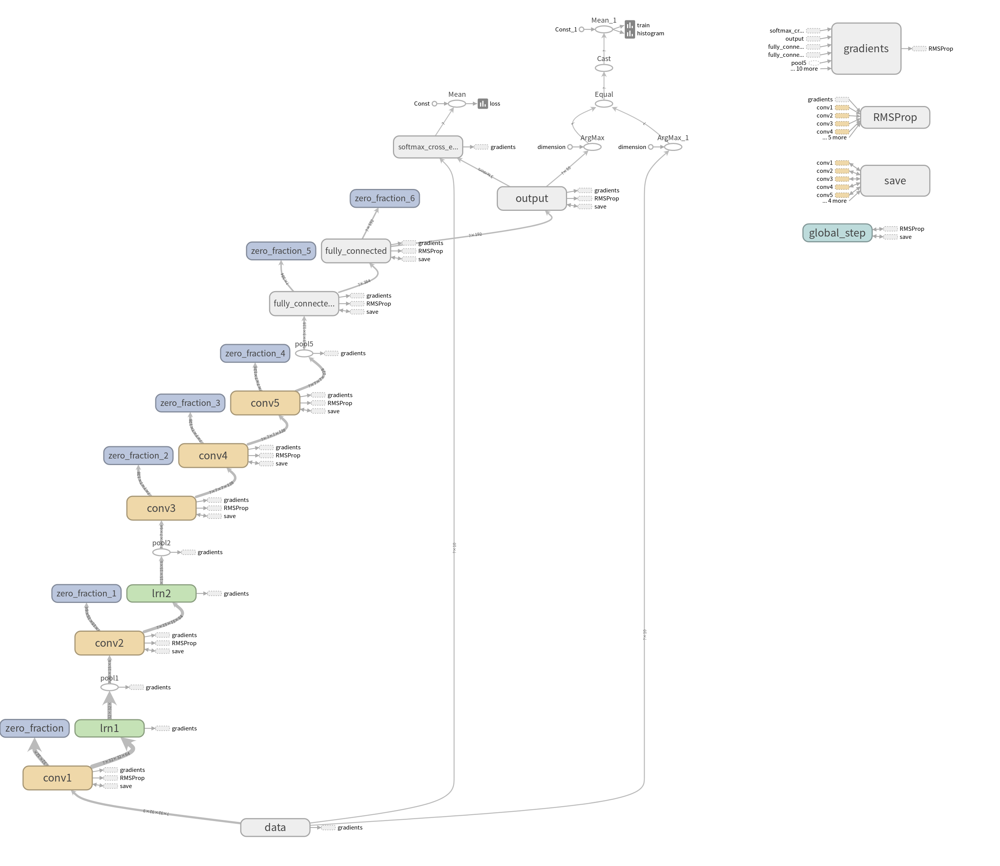
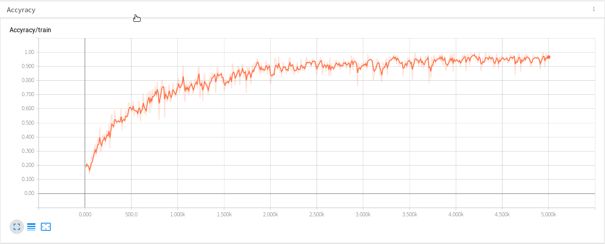

# Finetune AlexNet with Tensorflow

**Update 05.22.2019**

I revised the entire code base to work with the new input pipeline coming with TensorFlow >= version 1.9.0. 
This project do the experiments on cifar-10 for AlexNet.You can find an explanation of the new input pipeline in a new 
[blog post](https://kratzert.github.io/2017/06/15/example-of-tensorflows-new-input-pipeline.html) 
You can use this code as a simple example AlexNet on dataset cifar-10. 


This repository contains all the code needed to finetune 
[AlexNet](http://papers.nips.cc/paper/4824-imagenet-classification-with-deep-convolutional-neural-networks.pdf) on dataset cifar-10. 


**Note**: Please keep in mind that the network architecture is just same as the AlextNet, not is the models in the paper.

## Requirements

- Python 3
- TensorFlow >= 1.9.0
- Numpy


## TensorBoard support

The code has TensorFlows summaries implemented so that you can follow the training progress in TensorBoard. runing the TensorBoard by the command
```bash
tensorboard --logdir=./snapshot/board
```
The network vis 
 


The training acc 



## Content
-  data_set
    + cifar_10: the data for cifar-10 download from the [here](http://www.cs.toronto.edu/~kriz/cifar-10-python.tar.gz), you shoudn't download it by yourself,
        when you prepare to run the training process, it will download itself.
    + cifar_10_images_test: the jpg file for test data, when you run save_to_vis("test") function form data.py, this will create it.
    + cifar_10_images_train:the jpg file for test data, when you run save_to_vis("train") function form data.py, this will create it.
-  snapshot
    + board: the folder to save the TensorBoard file.
    + cifar-10: the folder to save the models.
- `alexnet.py`: Class with the graph definition of the AlexNet.
- `data.py`: Script to prepare the data for training and testing, while you can run the function save_to_vis to save images by the format jpg on your disk.
- `train.py`: Contains the training code for training ,you may have some parameters to finetuning by your self.
- `prdict.py`: run the predict on all images for testing datasets.

## Usage

I strongly recommend to take a look at the entire code of this repository. In the `train.py` script you will find a section of configuration settings 
you have to adapt on your problem.You can just run the command by:
```bash
python train.py
```
to do the training procedure, and then you will get all the dataset files, tensorboard file , model files,after that you will run to test results with predict.py.
```bash
python prdict.py
```


more about the data you could read the file [here](./data_set/cifar_10/readme.html).

The other option is that you bring your own method of loading images and providing batches of images and labels, but then you have to adapt the code on a 
few lines.
